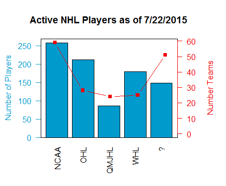

## How we scraped

First, we need a web scraping toolbox. We're partial to <a href="https://github.com/hadley/rvest">rvest</a> at OCS due to its simplicity. Grab that from github and install it.

We can only scrape all the NHL players' last names one letter at a time due to how the NHL website is set up.
```
#Input url for a single letter of alphabet and get the html
test_url = 'http://www.hockey-reference.com/players/g/skaters.html'
letter_url= html(test_url)
```

And now parse out the player name and URLs of each player's database page
```
#Parse out the player names and urls of individual pages
players = html_nodes(letter_url,'strong a')
names   = html_text(players)
plyurl  = html_attr(players,'href')
```

---

## How we scraped (part II)

The meat of the HTML interpretation is done with this.

```
preURL = 'http://www.hockey-reference.com'
playerURL = paste(preURL,plyurl[ii],sep="")
playerpage= html(playerURL)
  
teamList = html_nodes(playerpage,'a:nth-child(11)')
if(length(teamList)==0L){
  teamList = html_nodes(playerpage,'#info_box .bold_text+ a')
}
teamList = html_text(teamList)
prevTeam[ii] = teamList[1]
```
Essentially, this block of code scrapes that player's page for his amateur team and adds it to the master list of previous teams. Note that we need to cycle through each player when we do this.

---

## Grabbing the teams in each league

Once we have each team, we have to associate it with a league. They can be scraped from either wikipedia (useful for old teams), the league pages themselves, or the rankings pages. This example has the OHL directory:
```
ohlPage = 'http://www.ontariohockeyleague.com/page/ohl-team-directory'
ohlDesig= 'table+ table strong'
ohlURL = html(ohlPage)
ohlNodes=html_nodes(ohlURL,ohlDesig)
ohlTeamNames = html_text(ohlNodes)
```
And of course account for the teams that are now defunct.
```
ohlTeamNames <- append(ohlTeamNames,c('Plymouth Whalers','Brampton Battalion',
'Mississauga IceDogs','Belleville Bulls','North Bay Centennials'))
```

---

## Associate the teams with previously scraped data

First clean the teams to get rid of hyphens, apostrophes, and the like
```
qhl$QHLteams<-gsub("-", "", qhl$QHLteams)
```
And then get the league that the players' previous teams belong to
```
testData$League <- ifelse(as.character(testData$RecentAmateur) %in% as.character(ohl$OHLteams),
'OHL', ifelse(as.character(testData$RecentAmateur)%in%as.character(ncaa$NCAAteams),
'NCAA',ifelse(as.character(testData$RecentAmateur)%in%as.character(whl$WHLteams),
'WHL', ifelse(as.character(testData$RecentAmateur)%in%as.character(qhl$QHLteams),
'QMJHL',NA))))
```

---

## Finalize the image with the grouped information

Now we make the bar plot, taking care to leave enough space for good labeling
```
par(mar=c(5, 4.2, 4, 5) + 0.1)
dfbar<-barplot(pframe$Number,names.arg=pframe$League,ylab='',xlab='',axes=FALSE,
               main='Active NHL Players as of 7/22/2015',col='deepskyblue3',
               ylim=c(0,max(pframe$Number)+10),las=2)
```
Change the colors, label the axis for the bar plot, and put a box around it
```
axis(2, ylim=c(0,max(pframe$Number)),col='deepskyblue3',las=1,col.axis='deepskyblue3')
mtext("Number of Players",side=2,line=3,col='deepskyblue3')
box()
```

--- &twocol

## And add the normalization factor

We just use the length() function to find the number of teams in each league and overlay the plot to get the final result. We've included a black and white version as well, just for clarity.

*** =left


*** =right


--- 

## Some caveats about the study

1. There is a large age range of players in the NHL, and some of them have played for defunct teams. While the players have been accounted for, if there are very few of them from the defunct team, including that defunct team may inflate the number of teams in the league.

2. The '?' represents either non-North American leagues/teams or ones in leagues that weren't sortable in the way that the presented code sorted them. If this is the case, or you would like to expand the reach of the results, feel free to modify the code in the blog and comment!

3. Normalizing by the number of teams would yield that the CHL leagues produce more NHL ready players. However, if we allow that some NCAA schools (you know which ones I mean) don't focus on moving players to the pros compared to the Michigans and Miamis, the NCAA may compete with the CHL. We'd be interested to see someone take this sort of analysis into account.

4. And, finally, we must point out that goaltenders often take longer to develop. Readers are left to make their own inferences about Quick vs. DiPietro.

---

<style>
.title-slide {
  background-color: #D8D8D8; /* #EDE0CF; ; #CA9F9D*/
}
.title-slide hgroup > h2 {
  color: #8A0808 ;  /* ; #EF5150*/
}
.title-slide hgroup > h1 {
  color: #2E2E2E;
}
slide:not(.segue) h2{
  font-family: 'Calibri', Arial, sans-serif;
  font-size: 52px;
  font-style: normal;
  font-weight: bold;
  text-transform: normal;
  letter-spacing: -2px;
  line-height: 1.2em;
  color: #8A0808;
}
</style>


